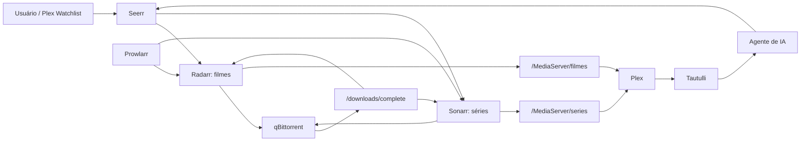
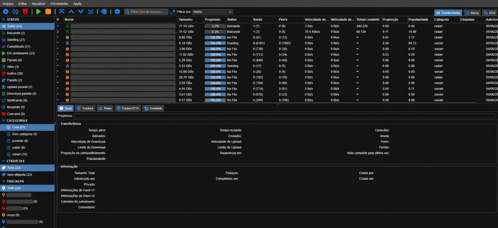
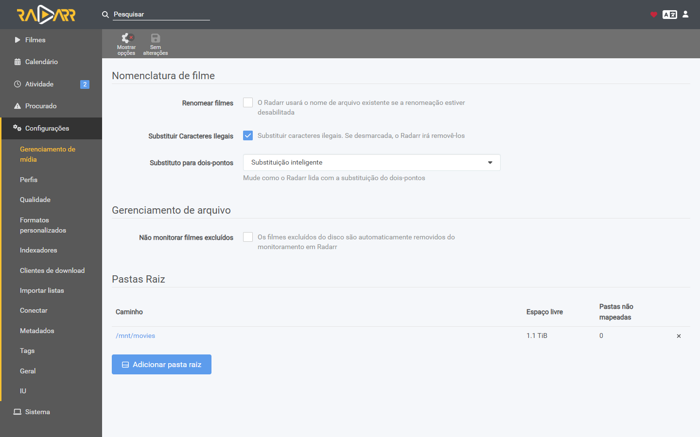
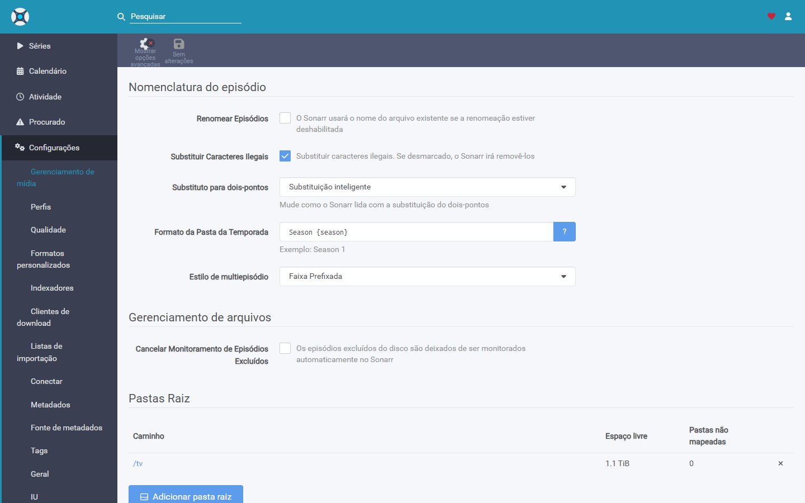
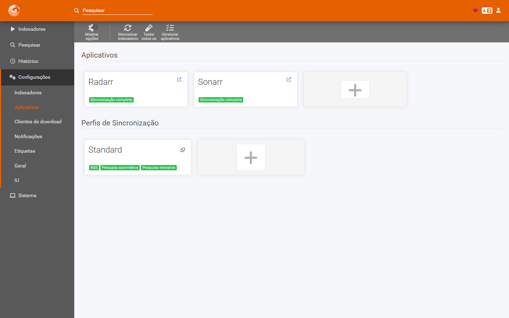
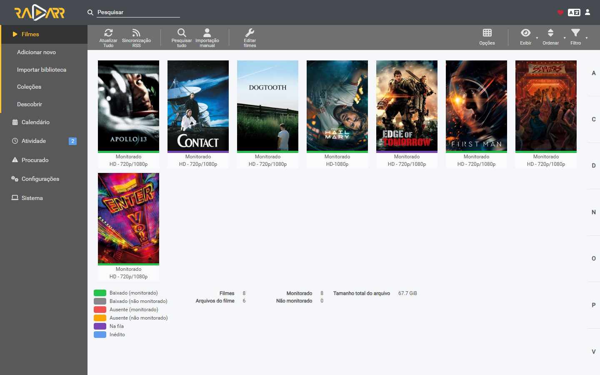
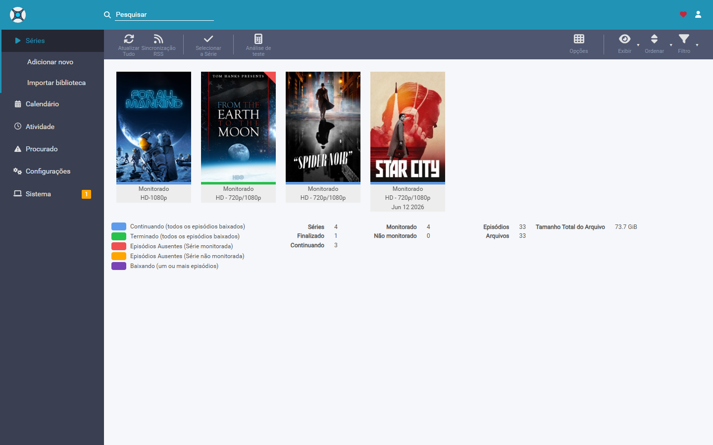

# Esteira de mídia com Plex, Seerr, *arr e agente de IA

Este repositório documenta uma esteira self-hosted para descobrir, solicitar,
organizar e assistir filmes e séries. O fluxo combina Plex, Seerr, Radarr,
Sonarr, Prowlarr, qBittorrent, Tautulli e um agente de IA executado
periodicamente pelo AICliAgents/Codex.

O objetivo não é substituir as ferramentas especializadas. O agente interpreta
preferências e histórico, enquanto Radarr e Sonarr continuam responsáveis pela
automação da biblioteca e o Plex continua responsável pela experiência de
reprodução.

> Use somente fontes e conteúdos que você tenha autorização legal para acessar,
> baixar e armazenar.

## Resultado

- Filmes solicitados chegam ao Radarr, são baixados e importados para o Plex.
- Séries solicitadas chegam ao Sonarr, com organização por série e temporada.
- Prowlarr centraliza fontes autorizadas e sincroniza Radarr e Sonarr.
- Seerr oferece descoberta e pedidos em uma interface única.
- A Watchlist do Plex pode adicionar filmes automaticamente ao Radarr.
- Tautulli registra o histórico de reprodução.
- Um agente semanal usa histórico, biblioteca e memória persistente para gerar
  recomendações e, quando permitido, criar até três pedidos de alta
  compatibilidade.

## Arquitetura



## Serviços

Substitua `${SERVER_IP}` pelo endereço local do servidor.

| Serviço | Imagem Docker usada | Porta | Papel |
|---|---|---:|---|
| Plex | `plexinc/pms-docker` | `32400` | Biblioteca, metadados e reprodução |
| qBittorrent | `lscr.io/linuxserver/qbittorrent` | `8081` | Cliente de download |
| Radarr | `ghcr.io/ich777/radarr` | `7878` | Filmes |
| Sonarr | `lscr.io/linuxserver/sonarr` | `8989` | Séries |
| Prowlarr | `bitlessbyte/prowlarr` | `9898` | Centralização de fontes |
| Seerr | `ghcr.io/seerr-team/seerr:latest` | `5055` | Descoberta e solicitações |
| Tautulli | `tautulli/tautulli` | `8181` | Histórico e métricas do Plex |
| AICliAgents/Codex | plugin do Unraid | interno | Agente de recomendação |

URLs locais:

```text
Plex:        http://${SERVER_IP}:32400/web
qBittorrent: http://${SERVER_IP}:8081
Radarr:      http://${SERVER_IP}:7878
Sonarr:      http://${SERVER_IP}:8989
Prowlarr:    http://${SERVER_IP}:9898
Seerr:       http://${SERVER_IP}:5055
Tautulli:    http://${SERVER_IP}:8181
```

## A regra mais importante: caminhos consistentes

Cada container enxerga nomes internos diferentes, mas eles precisam apontar
para os mesmos diretórios reais no host.

Estrutura usada no servidor:

```text
/mnt/user/MediaServer/
├── downloads/
│   ├── complete/
│   └── incomplete/
├── filmes/
├── series/
└── videos/
```

Mapeamentos Docker:

| Container | Caminho no host | Caminho no container |
|---|---|---|
| Plex | `/mnt/user/MediaServer` | `/data` |
| Plex | `/mnt/user/appdata/media-plex-server` | `/config` |
| Plex | `/mnt/user/appdata/media-plex-transcode` | `/transcode` |
| qBittorrent | `/mnt/user/MediaServer/downloads` | `/downloads` |
| Radarr | `/mnt/user/MediaServer/downloads` | `/downloads` |
| Radarr | `/mnt/user/MediaServer/filmes` | `/mnt/movies` |
| Sonarr | `/mnt/user/MediaServer/downloads` | `/downloads` |
| Sonarr | `/mnt/user/MediaServer/series` | `/tv` |
| Prowlarr | `/mnt/user/appdata/media-prowlarr-server` | `/config` |
| Seerr | `/mnt/user/appdata/media-seerr-server` | `/app/config` |
| Tautulli | `/mnt/user/appdata/media-tautulli-server` | `/config` |

Isso permite que o qBittorrent escreva em `/downloads/complete` e que Radarr e
Sonarr encontrem exatamente o mesmo arquivo, sem `Remote Path Mapping`.

## Configuração essencial

### qBittorrent

- Caminho de downloads completos: `/downloads/complete`
- Caminho de downloads incompletos: `/downloads/incomplete`
- Categoria de filmes: `radarr`
- Categoria de séries: `sonarr`
- Crie usuário e senha próprios para integração.



### Radarr

- Root Folder: `/mnt/movies`
- Download Client: qBittorrent
- Category: `radarr`
- Quality Profile: `HD - 720p/1080p`
- Minimum Availability: `Released`
- Import List opcional: `Plex Watchlist`
- `Enable Automatic Add` e `Search on Add`: habilitados quando a automação da
  Watchlist for desejada.



### Sonarr

- Root Folder: `/tv`
- Download Client: qBittorrent
- Category: `sonarr`
- Quality Profile: `HD - 720p/1080p`
- Series Type: `Standard`
- Season Folders: habilitado
- Monitor New Seasons: `All`



### Plex

Crie bibliotecas usando os caminhos internos do Plex:

| Biblioteca | Caminho |
|---|---|
| Filmes | `/data/filmes` |
| Programas de TV | `/data/series` |
| Outros vídeos | `/data/videos` |

O Plex não baixa mídia. `/transcode` é uma área temporária usada durante
conversões de vídeo; não é uma pasta de downloads.

### Prowlarr

- Adicione somente fontes autorizadas.
- Em `Settings > Apps`, integre Radarr e Sonarr.
- Use `Full Sync` para manter as fontes sincronizadas.
- Um `Indexer Proxy` normalmente não é necessário.



### Seerr

Integrações recomendadas:

| Serviço | URL | Root Folder | Perfil |
|---|---|---|---|
| Radarr | `http://${SERVER_IP}:7878` | `/mnt/movies` | `HD - 720p/1080p` |
| Sonarr | `http://${SERVER_IP}:8989` | `/tv` | `HD - 720p/1080p` |

Habilite `Enable Scan` e `Enable Automatic Search`. Tags e Override Rules podem
ficar vazios até existir uma regra concreta, como perfis diferentes por usuário
ou gênero.

### Tautulli

- Conecte-o ao servidor Plex.
- Use `Ignore Interval: 120` segundos para evitar registrar reproduções muito
  curtas.
- O histórico passa a alimentar o contexto do agente.

O painel do Tautulli registra estatísticas da biblioteca e histórico. Antes de
publicar uma captura, remova nomes de usuários e revise os títulos exibidos.

## Fluxos disponíveis

### Pedido manual pelo Seerr

```text
Seerr -> Radarr/Sonarr -> Prowlarr -> qBittorrent
      -> importação e organização -> Plex
```

### Plex Watchlist

No Radarr, uma `Import List` do tipo `Plex Watchlist` adiciona e pesquisa filmes
marcados na Watchlist. A lista externa informa atualização a cada seis horas,
mas a tarefa interna `Import List Sync` pode ser executada manualmente para
testes.

### Recomendação automática

```text
Tautulli + biblioteca + memória
        -> agente semanal
        -> recomendações justificadas
        -> pedido no Seerr, quando permitido
        -> fluxo normal de download e importação
```

Veja a configuração completa do agente em
[docs/AGENTE_IA.md](docs/AGENTE_IA.md).

## Ordem de implantação

1. Criar a estrutura de pastas no host.
2. Configurar Plex e validar as bibliotecas.
3. Configurar qBittorrent e seus caminhos.
4. Configurar Radarr e testar um filme.
5. Configurar Sonarr e testar uma série.
6. Configurar Prowlarr e sincronizar os aplicativos.
7. Configurar Seerr e testar pedidos.
8. Configurar Tautulli e gerar histórico.
9. Configurar o agente em modo de recomendação sem pedidos automáticos.
10. Ativar automação limitada somente depois de validar os resultados.

## Documentação

- [Configuração detalhada](docs/CONFIGURACAO.md)
- [Agente de IA e rotina semanal](docs/AGENTE_IA.md)
- [Segurança](docs/SEGURANCA.md)
- [Solução de problemas](docs/TROUBLESHOOTING.md)
- [Checklist de publicação](docs/PUBLICACAO.md)

## Capturas

As imagens deste repositório foram capturadas da instalação real, sem senhas,
tokens ou chaves de API. O script
[`scripts/capture-media-docs.cjs`](scripts/capture-media-docs.cjs) captura
somente páginas consideradas seguras. A captura do qBittorrent publicada foi
sanitizada para ocultar nomes de downloads e trackers:

```powershell
npm install --no-save playwright
$env:MEDIA_SERVER_IP = "192.168.1.100"
node .\scripts\capture-media-docs.cjs
```

## Estado atual




